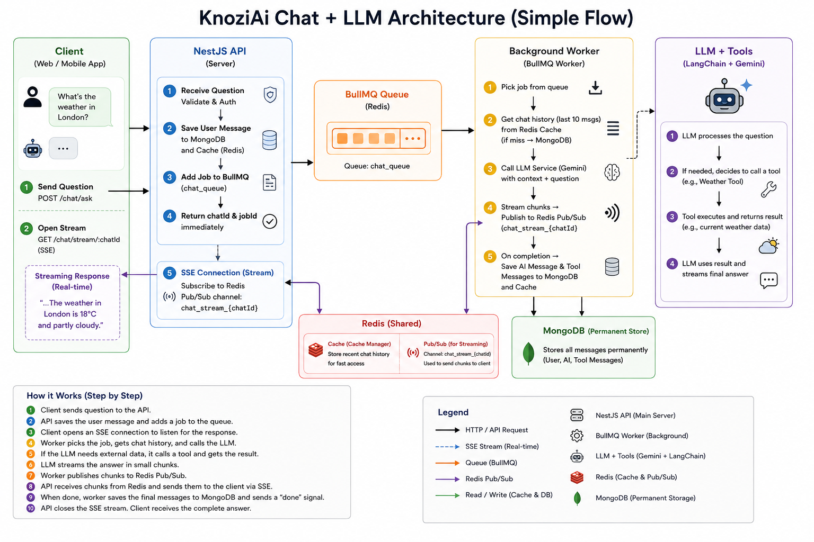
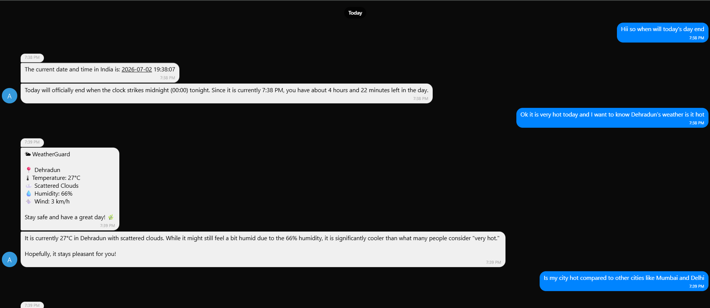
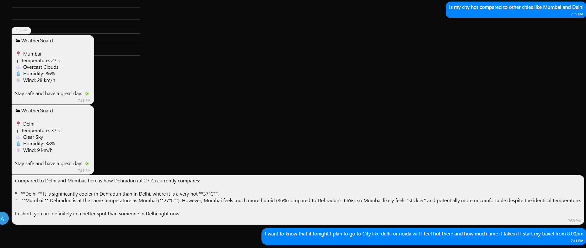
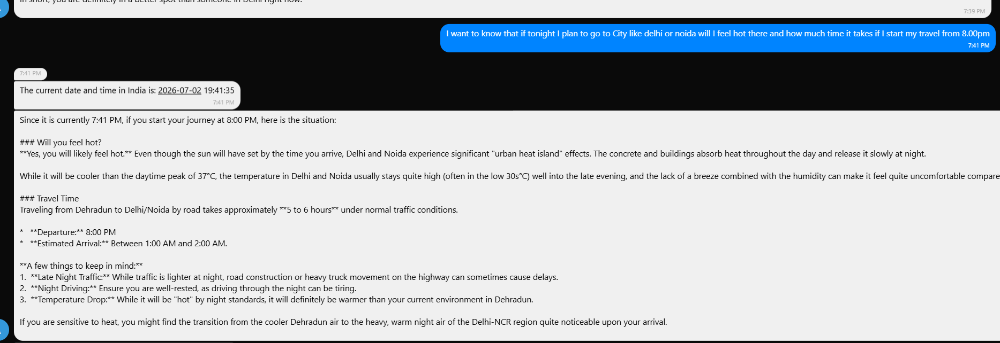

# KnoziAi Architecture & Flow

> [!WARNING]
> This summary and documentation was quickly generated using AI and will be implemented/refined later.

## Live Deployments
- **Frontend Web**: [https://knozi-ai.vercel.app](https://knozi-ai.vercel.app)
- **REST API Docs**: [https://knoziai-production.up.railway.app/api](https://knoziai-production.up.railway.app/api)
- **Android APK**: An APK has also been successfully created and is ready for use.

## Previews
Here are some examples of how it is working:

This document outlines the architecture and data flow of the Chat and LLM integration within KnoziAi, detailing how NestJS, BullMQ, Redis (Cache Manager & Pub/Sub), and LangChain (Gemini LLM with Tools) work together in synchronization.

## High-Level Architecture

KnoziAi uses an asynchronous, event-driven architecture to handle chat messages, allowing for long-running LLM tasks (like tool execution) without blocking the main HTTP threads, while providing real-time streaming updates to the client.

### Core Components
1. **NestJS**: The main application framework handling routing, dependency injection, and security.
2. **BullMQ**: A Redis-based queue used to offload LLM processing to background workers.
3. **Redis (Cache Manager)**: Used to temporarily store recent chat history for fast retrieval, minimizing MongoDB hits.
4. **Redis (Pub/Sub)**: Used to broadcast LLM response chunks from the background worker back to the client's Server-Sent Events (SSE) stream.
5. **LangChain & Gemini**: The LLM engine bound with dynamic tools (e.g., Current Time, Weather).

---

## Detailed Request Flow

### 1. Initiating the Chat (Client -> API -> BullMQ)
1. **HTTP Request**: The client sends a `POST /chat/ask` request containing the user's question.
2. **Database & Cache**: `ChatService` retrieves or creates the chat session and saves the user's `HumanMessage` to MongoDB and the Cache Manager (Redis).
3. **Queueing**: Instead of waiting for the LLM response synchronously, the service adds a job to the BullMQ `chat_queue` with the `chatId` and `question`.
4. **Immediate Response**: The API immediately responds to the client with the `chatId` and `jobId`.

### 2. Streaming Connection (Client -> API -> Redis Pub/Sub)
1. **SSE Subscription**: Immediately after calling `/chat/ask`, the client establishes a Server-Sent Events (SSE) connection via `GET /chat/stream/:chatId`.
2. **Pub/Sub Listener**: The `ChatController` duplicates a Redis client and subscribes to a unique Pub/Sub channel: `chat_stream_{chatId}`. It waits for messages to stream back to the client.

### 3. Background Processing (BullMQ Worker)
1. **Job Consumption**: The `ChatProcessor` (BullMQ WorkerHost) picks up the job from the `chat_queue`.
2. **Context Retrieval**: It retrieves the last 10 messages of the chat history from the Cache Manager (or falls back to MongoDB) to provide context for the LLM.
3. **LLM Invocation**: The processor calls `GeminiLlmService.askWithToolsAndContextStream()`.

### 4. LLM & Tool Execution (LangChain)
1. **Tool Binding**: The `GeminiLlmService` binds registered tools (e.g., `CurrentTimeTool`, `WeatherTool`) to the Gemini model.
2. **Initial Stream**: The LLM processes the conversation. If it can answer immediately, it streams text chunks back.
3. **Tool Calls**: If the LLM determines it needs external data (e.g., "What's the weather in London?"), it stops streaming text and outputs a `tool_call`.
4. **Local Execution**: The `GeminiLlmService` intercepts the `tool_call`, executes the corresponding local tool (`WeatherTool`), and gets the result.
5. **Secondary Stream**: The service appends the `ToolMessage` (the result of the tool) to the conversation context and streams the LLM *again* so it can formulate a final natural language answer using the tool's data.

### 5. Real-Time Streaming (Worker -> Redis Pub/Sub -> Client)
1. **Publishing Chunks**: As the `GeminiLlmService` yields string chunks, the `ChatProcessor` publishes them to the Redis Pub/Sub channel (`chat_stream_{chatId}`).
2. **SSE Delivery**: The `ChatController` receives these chunks via its Pub/Sub subscription and instantly forwards them to the client through the SSE connection.
3. **Completion**: Once the LLM stream finishes, the worker saves the final `AIMessage` and any `ToolMessage`s to MongoDB and Cache. It then publishes a `{ done: true }` signal via Pub/Sub, causing the controller to cleanly close the SSE stream.
